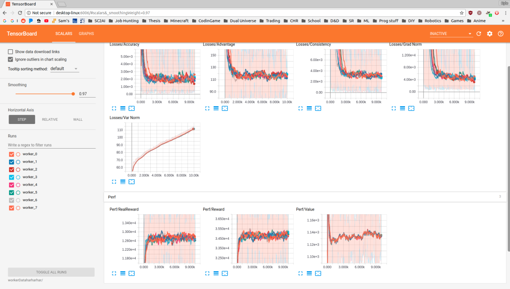

# ResourceGather

This project implements an A3C reinforcement learning agent to build bases and gather resources as quickly as possible
using a restricted action space. The project fulfills the requirements of Senior Design (CSC465) at South Dakota School of Mines
and Technology.


## Dependencies

This project requires the following python libraries:

- [pysc2](https://github.com/deepmind/pysc2) - We use a modified version of the pysc2 environment.
(see [Details](#modifications-of-the-pysc2-rl-environment))
- numpy
- tensorflow

## Important Links and Background

Our project is based on
[greentfrapp/pysc2-RLagents](https://github.com/greentfrapp/pysc2-RLagents]), an implementation of A3C to which uses
AtariNet in the way described in the [DeepMind SC2LE](https://deepmind.com/documents/110/sc2le.pdf) paper to solve the 
suite of standard PySC2 minigames. The corresponding blog post can be found 
[here](https://deepmind.com/blog/deepmind-and-blizzard-open-starcraft-ii-ai-research-environment/).

The [pysc2-RLagents](https://github.com/greentfrapp/pysc2-RLagents]) implementation was based on a wonderful
[reinforcement learning tutorial](https://medium.com/emergent-future/simple-reinforcement-learning-with-tensorflow-part-8-asynchronous-actor-critic-agents-a3c-c88f72a5e9f2) 
by Arthur Juliani on [medium.com](https://medium.com/emergent-future). We also studied [Chris' repo](https://github.com/chris-chris/pysc2-examples)
which uses a synchronus version of the Advantage Actor-Critic algorithm (A2C), as well as DQN.

## Running the Model SC2 Resource Gathering Enviornment

The test is located in the following folder inside this project directory:

[tests/sc2_ez_model](tests/sc2_ez_model)

At it's simplest the model environment can be used like this, with plenty of 
other options for experimental purposes.

```buildoutcfg
$ python tests/sc2_ez_env/ez_main.py --train
Running workers...

$ python tests/sc2_ez_env/ez_main.py --help
usage: ez_main.py [-h] [--train | --test] [--logdir DIRNAME | --gendir]
                  [--hyper-parameter-search]
                  [--seed SEED | --seed_range LOWER UPPER]

optional arguments:
  -h, --help            show this help message and exit
  --train               If specified, no checkpoint will be loaded, and a new
                        model will be created. (Default: True)
  --test                If specified, a checkpoint will be loaded from
                        logdir/model if it exists. (Default: False)
  --logdir DIRNAME      If specified, the model and training metrics will be
                        loaded or stored in this location. (Default: 'workers')
  --gendir              If specified, the logdir will be set to
                        'test_YYYYmmddHHMMSS' (Default: False)
  --hyper-parameter-search
                        If specified, the program will spin up several
                        experiments with different hyper parameters, based on
                        the seed_range. (Default: False)
  --seed SEED           If a hyper parameter search is performed, and a
                        seed_range is not specified, a single run will occur
                        with the hyper parameters corresponding to that seed.
                        The seed is appended to logdir. (Default: 0)
  --seed_range LOWER UPPER
                        The range of seeds to use during the hyper parameter
                        search, the seed is appended to logdir. (Default:
                        None)
```
## Analysis with TensorBoard

TensorFlow comes with a great tool for visualizing machine learning models constructed with their library called
TensorBoard. It can be used to monitor training for the SC2 Model environment with:

```buildoutcfg
$ tensorboard --logdir=DIRNAME
TensorBoard 1.7.0 at http://localhost:6006 (Press CTRL+C to quit)
```

Following the given link will bring up a page like:



A visualization of the TensorFlow graph for our implementation is available under the `Graphs` tab in the user interface.
## Running the Project

**The main project code will not work in it's current state**

Once you have downloaded our custom map and placed it the proper directory in `StarCraft II/Maps/resource_gather` you
can run the following command from the project directory. See [adding a map](#adding-a-map) for more details on how
to add custom maps to the project.

```buildoutcfg
path_to_repo/ResourceGather/main.py --train
Running GrubbyAI...
```

Further optional parameters can also be specified to configure the agent, environment, and map 
or mini-game that you'd like to train on.

```buildoutcfg
path_to_repo/ResourceGather/main.py --help
usage:
    --This feature is in development--
```

## Modifications of the PySC2 RL Environment

In order to define a smaller, high level action space for StarCraft II, we needed to pull in some of the raw
game data provided through the [s2client-proto](https://github.com/Blizzard/s2client-proto) to make coding these
compound actions easier. There is also important difficult to learn information that we do not think an agent
can learn without a much more controlled training procedure.